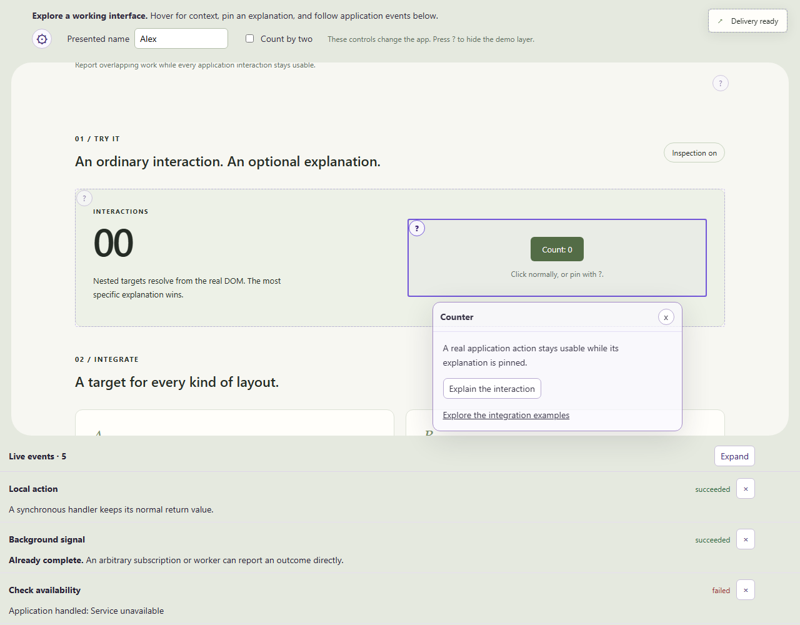
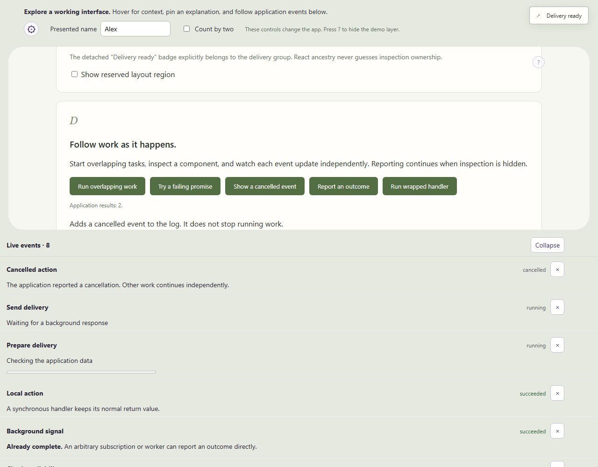

# Demoable React

Demoable React adds an optional explanatory layer to React demos. Viewers can discover annotated regions, pin rich explanations, and continue using the application. The library includes component inspection and independent live events: follow overlapping work, inspect rich context, and keep using the application. The runnable demo uses synthetic asynchronous work; it has no backend integration.



Orientation and host controls sit above a rounded, inset app surface; live events sit below it. Each region owns its scrolling space, and pinned explanations avoid the panels.

## What it demonstrates

- **Context without layout changes:** a provider registry tracks explicit DOM targets; a portal renders pointer-transparent outlines and individually selectable pin controls.
- **Deliberate exploration:** actual DOM paths choose the deepest nested target. Hover has a 300 ms leave grace; pinning freezes selection and supports direct transfer, dismissal, and unmount cleanup.
- **Real geometry:** component-relative fit and overlap fallback use the visible target rectangle, track scrolling and layout movement, and accommodate registered occupied regions.
- **Reusable integration:** wrapper, existing-element refs, multi-root groups, and explicit portal ownership work with React 18 and 19. Rich context can contain links and ordinary controls. Hovering the circular ? also keeps its attached explanation open.
- **Independent event lifecycles:** stable handles update concurrent same-label work without reordering it; manual, timed and outcome-specific retention continues while hidden. Handler and promise helpers preserve application results and errors.
- **Measured live history:** actual row geometry sizes an embeddable log continuously; a separate scrolling surface preserves older-entry position and fits within half the viewport.
- **Independent presentation settings:** desktop activation, mobile behavior, surface-owned settings, and separate background/text opacity leave host application behavior intact.

## Architecture and stack

| Layer | Implementation |
| --- | --- |
| Public API | TypeScript 5.9.3, React context, components and hooks |
| Rendering | React DOM portals; scoped package CSS and visual tokens |
| Events | Provider-scoped immutable snapshots, explicit lifecycle handles and deadline timers; useSyncExternalStore and ResizeObserver for the log |
| Registry and geometry | Provider-owned identities and DOM members; ResizeObserver, scroll capture and visible-only frame tracking |
| Distribution | ESM JavaScript, public declarations and explicit stylesheet export; React/DOM peer dependencies |
| Build and validation | Vite 8.3.3, Vitest/Testing Library, Playwright 1.64.0; actual packed-package consumers |

Registration connects a stable identity to explicit DOM members and context. Input chooses one active identity; measured geometry places outlines, pin controls, and one context panel. Each provider owns its settings, selection and event store. The log subscribes to immutable snapshots and reserves its measured region for context placement. There is no backend, telemetry, persistent storage, or required CSS framework. [Inspection rules](docs/api/inspection.md), [event APIs and lifetime semantics](docs/api/events.md), and [layout and orientation controls](docs/api/layout.md) document the exact integration contracts.

## Run locally

Verified environment: Windows PowerShell, Node **22.19.0**, npm **11.5.2**. From a fresh checkout:

```powershell
git clone https://github.com/borwood/demoable-react.git
cd demoable-react
npm ci
npm run build
npm run dev -- --port 5173 --strictPort
```

Open <http://127.0.0.1:5173>. No account, API key, environment variables, or external service is needed. Dependency installation requires network access. The demo imports the built package; restart `npm run dev` after library edits. Vite updates demo edits while running.

### Short walkthrough

1. Press **?** or click **Start inspecting** to show the demo layer: orientation, working controls and events. Edit **Presented name** or toggle **Count by two** to change the app. Registered regions gain outlines and circular **?** controls.
2. Hover the counter card, then its nested counter. Only the deepest component's explanation appears.
3. Click the counter's circular **?**. Click **Explain the interaction** inside the pinned context, then increment **Count** in the app. Both remain interactive.
4. Click another circular **?** to transfer the pin. Click it again or **x** to dismiss. Unmount **Existing button** to verify a removed target cannot retain a pin.
5. Inspect both delivery cards and the detached delivery badge. They share one explicit group. The live log automatically reserves its actual region for context placement.
6. Run the live event examples: start overlapping previews, report a failure, click **Show a cancelled event** at any time and add an outcome-only event. Every cancellation click adds a new cancelled entry and confirms it beside the controls; it leaves other work running. Expand the log, scroll older entries and add more events; entries remain individually inspectable. These actions simulate application work locally.
7. Open the gear at the start of the top controls row, toggle the two modes independently, and adjust **Info and settings background opacity**. Orientation and gear stay visible even with both modes off. **?** removes the whole demo frame and returns the app to its normal layout and page scrolling while preserving state. The anchored menu remains reachable on resize.



The expanded history fits its contents up to half the viewport and scrolls beyond that bound. Hide events in settings while work runs, then restore the log to see current retained outcomes.

On desktop, **?** ignores editable fields, held-key repeats, and composition input. Auto mobile mode uses `(hover: none) and (pointer: coarse)`; touch-capable laptops with a fine primary pointer remain desktop. Hosts can override this with `device="desktop"` or `device="mobile"`. Mobile stays active; tap circular **?** to pin. The initialization hint is visible only while the demo layer is active, within its initial four seconds plus one-second fade. Activating later does not restart it. Reduced motion removes the fade.

### Stop or reset

Stop the dev server with **Ctrl+C in its own terminal**. Refresh resets in-memory demo state. There is no application database or cross-session state to remove.

## Try the package

Install version 0.1.0 in an existing React project:

```powershell
npm install @borwood/demoable-react@0.1.0
```

The [npm version page](https://www.npmjs.com/package/@borwood/demoable-react/v/0.1.0) shows registry availability. To evaluate a checkout before a registry release, run `npm ci`, `npm run build` and `npm pack` in the source repository, then install the generated archive by its actual path:

```powershell
npm install C:/path/to/demoable-react/borwood-demoable-react-0.1.0.tgz
```

Supply matched React and React DOM versions, and import the stylesheet explicitly:

```tsx
import { InspectionProvider, Inspectable, DemoLayout } from '@borwood/demoable-react';
import '@borwood/demoable-react/styles.css';

export function Demo() {
  return <InspectionProvider device="auto" initialOpacity={0.75}>
    <DemoLayout orientation={<p>Explore this local draft editor.</p>}>
      <main>
        <Inspectable label="Save action" context={<p>Saves your draft.</p>}>
          <button onClick={() => console.log('save')}>Save</button>
        </Inspectable>
      </main>
    </DemoLayout>
  </InspectionProvider>;
}
```

`DemoLayout` handles the presentation grid; pass your own React controls through its `controls` prop. `OrientationPanel` and `EventLog` also work independently in host-selected positions. Mount `DemoLayout` or `OrientationPanel` to provide settings; the provider alone does not add a gear. `Inspectable` renders a `div`. Use [`useInspectable`](docs/api/inspection.md) for table, inline, flex/grid-sensitive or existing markup. `packageInfo` and its `PackageInfo` type remain available. There is no CommonJS export. Distributed under the [MIT license](LICENSE), Copyright (c) 2026 borwood.

## Verify

Install the browser engines once, then run the configured checks:

```powershell
npx playwright install chromium firefox webkit
npm run typecheck
npm run test:integration
npm run build
npm run test:consumer
npm run test:browser
```

Skill metadata, deterministic parity, portable links and complete example assets are checked during typechecking. Integration tests cover provider state, event lifetimes, sync/async handler preservation, reporting failures, activation exclusions and cleanup. Consumer checks install a real tarball into isolated React 18/19 projects, then compile and build the exported API/types/styles. Browser checks exercise actual target geometry, nested/group/portal selection, interactive panels, pins, anchored settings/resize, mobile settings, lifecycle cleanup, orientation/state preservation, three-region layout, all adjacent sides and overlap fallback, event ordering, measured variable rows, expansion, scroll anchoring and hidden expiry in all three engines. The runner prints exact versions and results, owns its HTTP/browser handles, and closes them and removes temporary consumers after success or failure. Browser binaries remain cached.

| Compatibility | Tested targets |
| --- | --- |
| React / React DOM | 18.3.1 and 19.3.0, matched pairs |
| React / DOM types | 18.3.31 / 18.3.7 and 19.3.0 / 19.3.0 |
| Browsers | Playwright Chromium, Firefox and WebKit on Windows |

The peer range is `^18.3.1 || ^19.3.0`; only the exact pairs above are tested. Playwright WebKit is an automated engine build, not evidence from real Safari or an iOS device. Other operating systems are not validated here.

## Current boundaries

Portable [agent and Claude skills](docs/integration-skills.md) and [runnable examples](docs/examples.md) ship with the npm package and local archive. Event history is in memory; there is no persistence, remote event transport, automatic grouping or eviction. The demo performs synthetic application work and has no service integration or deployment configuration.

Production bundle exclusion is not implemented: hiding inspection at runtime does not remove bundled code. The demo has no hosted deployment. Compatibility evidence is limited to the tested matrix above.
